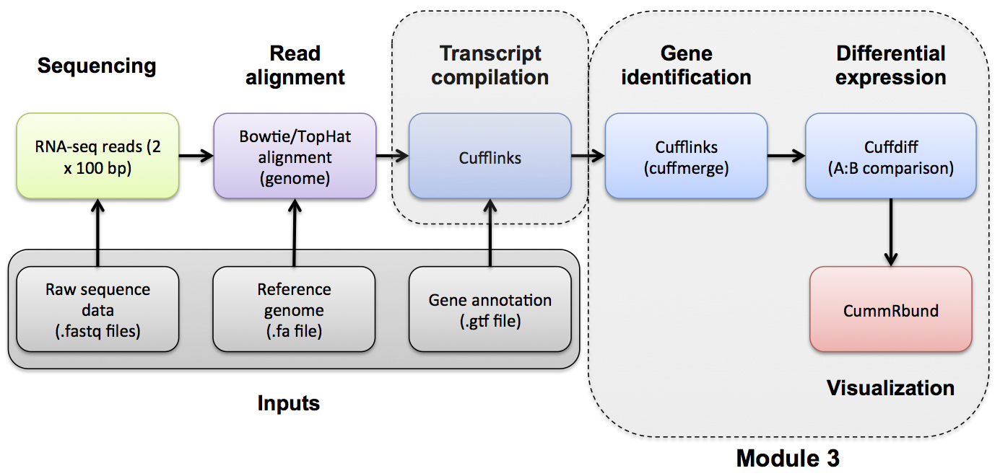

#2-i. Adapter Trim
[OPTIONAL]
Use Flexbar to trim sequence adapter from the read FASTQ files.  The output of this step will be trimmed FASTQ files for each data set.

Refer to the Flexbar project and manual for a more detailed explanation:
* http://sourceforge.net/projects/flexbar/
* http://sourceforge.net/p/flexbar/wiki/Manual/

Flexbar basic usage:
```
#flexbar -r reads [-t target] [-b barcodes] [-a adapters] [options]
```
	
Extra options specified below:

* '--adapter-min-overlap 7' requires a minimum of 7 bases to match the adapter
* '--adapter-trim-end RIGHT' uses a trimming strategy to remove the adapter from the 3' end or RIGHT end of the read
* '--max-uncalled 300' allows as many as 300 uncalled or N bases (MiSeq read lengths can be 300bp)
* '--min-read-length' the minimum read length allowed after trimming is 25bp.  TopHat has a default segment length of 25bp.  The smallest read size should be at least one segment length.
* '--threads 8 ' use 8 threads
* '--zip-output GZ' the input FASTQ files are gzipped so we will output gzipped FASTQ to save space
* '--adapters ' define the path to the adapter FASTA file to trim
* '--reads ' define the path to the read 1 FASTQ file of reads
* '--reads2 ' define the path to the read 2 FASTQ file of reads
* '--target ' a base path for the output files.  The value will _1.fastq.gz and _2.fastq.gz for read 1 and read 2 respectively
* '--pre-trim-left' trim a fixed number of bases at left read end. For example, to trim 5 bases at the left side of reads: --pre-trim-left 5
* '--pre-trim-right' trim a fixed number of bases at right read end. For example, to trim 5 bases at the right side of reads: --pre-trim-right 5
* '--pre-trim-phred' trim based on phred quality value to deal with higher error rates towards the end of reads. For example, to trim the 3' end until quality offset value 30 or higher is reached, specify: --pre-trim-phred 30

##Flexbar trim

First, set up some directories for output

```
cd $RNA_HOME/
export RNA_DATA_DIR=$RNA_HOME/data
echo $RNA_DATA_DIR

mkdir -p $RNA_DATA_DIR/trimmed
export RNA_DATA_TRIM_DIR=$RNA_DATA_DIR/trimmed
echo $RNA_DATA_TRIM_DIR
```

Download necessary Illumina adaptor sequence files.

```
cd $RNA_HOME/refs
wget ftp://genome.wustl.edu/pub/rnaseq/trim/illumina_multiplex.fa
```

Use flexbar to remove illumina adaptor sequences (if any) and trim first 13 bases of each read. In our tests, each sample took ~30 seconds to trim
```
cd $RNA_HOME
flexbar --adapter-min-overlap 7 --adapter-trim-end RIGHT --adapters $RNA_HOME/refs/illumina_multiplex.fa --pre-trim-left 13 --max-uncalled 300 --min-read-length 25 --threads 8 --zip-output GZ --reads $RNA_DATA_DIR/UHR_Rep1_ERCC-Mix1_Build37-ErccTranscripts-chr22.read1.fastq.gz --reads2 $RNA_DATA_DIR/UHR_Rep1_ERCC-Mix1_Build37-ErccTranscripts-chr22.read2.fastq.gz --target $RNA_DATA_TRIM_DIR/UHR_Rep1_ERCC-Mix1_Build37-ErccTranscripts-chr22
flexbar --adapter-min-overlap 7 --adapter-trim-end RIGHT --adapters $RNA_HOME/refs/illumina_multiplex.fa --pre-trim-left 13 --max-uncalled 300 --min-read-length 25 --threads 8 --zip-output GZ --reads $RNA_DATA_DIR/UHR_Rep2_ERCC-Mix1_Build37-ErccTranscripts-chr22.read1.fastq.gz --reads2 $RNA_DATA_DIR/UHR_Rep2_ERCC-Mix1_Build37-ErccTranscripts-chr22.read2.fastq.gz --target $RNA_DATA_TRIM_DIR/UHR_Rep2_ERCC-Mix1_Build37-ErccTranscripts-chr22
flexbar --adapter-min-overlap 7 --adapter-trim-end RIGHT --adapters $RNA_HOME/refs/illumina_multiplex.fa --pre-trim-left 13 --max-uncalled 300 --min-read-length 25 --threads 8 --zip-output GZ --reads $RNA_DATA_DIR/UHR_Rep3_ERCC-Mix1_Build37-ErccTranscripts-chr22.read1.fastq.gz --reads2 $RNA_DATA_DIR/UHR_Rep3_ERCC-Mix1_Build37-ErccTranscripts-chr22.read2.fastq.gz --target $RNA_DATA_TRIM_DIR/UHR_Rep3_ERCC-Mix1_Build37-ErccTranscripts-chr22

flexbar --adapter-min-overlap 7 --adapter-trim-end RIGHT --adapters $RNA_HOME/refs/illumina_multiplex.fa --pre-trim-left 13 --max-uncalled 300 --min-read-length 25 --threads 8 --zip-output GZ --reads $RNA_DATA_DIR/HBR_Rep1_ERCC-Mix2_Build37-ErccTranscripts-chr22.read1.fastq.gz --reads2 $RNA_DATA_DIR/HBR_Rep1_ERCC-Mix2_Build37-ErccTranscripts-chr22.read2.fastq.gz --target $RNA_DATA_TRIM_DIR/HBR_Rep1_ERCC-Mix2_Build37-ErccTranscripts-chr22
flexbar --adapter-min-overlap 7 --adapter-trim-end RIGHT --adapters $RNA_HOME/refs/illumina_multiplex.fa --pre-trim-left 13 --max-uncalled 300 --min-read-length 25 --threads 8 --zip-output GZ --reads $RNA_DATA_DIR/HBR_Rep2_ERCC-Mix2_Build37-ErccTranscripts-chr22.read1.fastq.gz --reads2 $RNA_DATA_DIR/HBR_Rep2_ERCC-Mix2_Build37-ErccTranscripts-chr22.read2.fastq.gz --target $RNA_DATA_TRIM_DIR/HBR_Rep2_ERCC-Mix2_Build37-ErccTranscripts-chr22
flexbar --adapter-min-overlap 7 --adapter-trim-end RIGHT --adapters $RNA_HOME/refs/illumina_multiplex.fa --pre-trim-left 13 --max-uncalled 300 --min-read-length 25 --threads 8 --zip-output GZ --reads $RNA_DATA_DIR/HBR_Rep3_ERCC-Mix2_Build37-ErccTranscripts-chr22.read1.fastq.gz --reads2 $RNA_DATA_DIR/HBR_Rep3_ERCC-Mix2_Build37-ErccTranscripts-chr22.read2.fastq.gz --target $RNA_DATA_TRIM_DIR/HBR_Rep3_ERCC-Mix2_Build37-ErccTranscripts-chr22	
```

Optional exercise: Compare the FastQC reports for fastq files before and after trimming. All fastqc reports can be generated on the commandline.

```
cd $RNA_HOME/data/trimmed/
fastqc *.fastq.gz
```

The resulting html reports can be viewed by navigating to:
* http://cbw##.dyndns.info/rnaseq/data/
* http://cbw##.dyndns.info/rnaseq/data/trimmed/

| [[Previous Section|PreAlignment-QC]] | [[This Section|Adapter Trim]] | [[Next Section|Alignment]] |
|:------------------------------------:|:--------------------------:|:--------------------------------------------:|
| [[Data QC|PreAlignment-QC]]          | [[Adapter Trim|Adapter-Trim]]    | [[Alignment|Alignment]]         |
