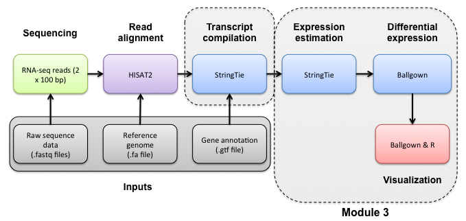

u

#3-iii. Ballgown DE Visualization
 
Navigate to the correct directory and then launch R:

```bash

cd $RNA_HOME/de/ballgown/ref_only
R

```

A separate R tutorial file has been provided in the github repo for part 2 of the tutorial: [Tutorial_Module4_Part2_ballgown.R](https://github.com/griffithlab/rnaseq_tutorial/blob/master/scripts/Tutorial_Module4_Part2_ballgown.R). Run the R commands detailed in the R script. All results are directed to pdf file(s). The output pdf files can be viewed in your browser at the following urls. Note, you must replace __YOUR_IP_ADDRESS__ with your own amazon instance IP (e.g., 101.0.1.101)).

* http://__YOUR_IP_ADDRESS__/workspace/rnaseq/de/ballgown/ref_only/Tutorial_Part2_ballgown_output.pdf
	
##SUPPLEMENTARY R ANALYSIS 

Occasionally you may wish to reformat and work with stringtie output in R manually. Therefore we provide an optional/advanced tutorial on how to format your results for R and perform "old school" (non-ballgown analysis) on your data.

In this tutorial you will:

* Learn basic R usage and commands (common plots, and data manipulation tasks)
* Examine the expression estimates
* Create an MDS plot to visualize the differences between/among replicates, library prep methods and UHR versus HBR
* Examine the differential expression estimates
* Visualize the expression estimates and highlight those genes that appear to be differentially expressed
* Generate a list of the top differentially expressed genes
* Ask how reproducible technical replicates are.

Expression and differential expression files will be read into R. The R analysis will make use of the transcript-level expression and differential expression files from stringtie/ballgown. Navigate to the correct directory and then launch R:

```bash

cd $RNA_HOME/de/ballgown/ref_only/
R

```

A separate R file has been provided in the github repo for part 3 of the tutorial: [Tutorial_Module4_Part3_Supplementary_R.R](https://github.com/griffithlab/rnaseq_tutorial/blob/master/scripts/Tutorial_Module4_Part3_Supplementary_R.R). Run the R commands detailed in the R script above. 

The output file can be viewed in your browser at the following url. Note, you must replace __YOUR_IP_ADDRESS__ with your own amazon instance IP (e.g., 101.0.1.101)).
* http://__YOUR_IP_ADDRESS__/workspace/rnaseq/de/ballgown/ref_only/Tutorial_Part3_Supplementary_R_output.pdf

##ERCC DE Analysis

This section will demonstrate the DE between the ERCC spike-in:

```bash

cd $RNA_HOME/de/ballgown/ref_only
wget https://raw.githubusercontent.com/griffithlab/rnaseq_tutorial/master/scripts/Tutorial_Module4_ERCC_DE.R
chmod +x Tutorial_Module4_ERCC_DE.R
./Tutorial_Module4_ERCC_DE.R $RNA_HOME/expression/htseq_counts/ERCC_Controls_Analysis.txt $RNA_HOME/de/ballgown/ref_only/UHR_vs_HBR_gene_results.tsv

```

View the results here:
* http://__YOUR_IP_ADDRESS__/workspace/rnaseq/de/ballgown/ref_only/Tutorial_Module4_ERCC_DE.pdf

##edgeR Analysis		

In this tutorial you will:

* Make use of the raw counts you generate above using htseq-count
 * edgeR is a bioconductor package designed specifically for differential expression of count-based RNA-seq data
 * This is an alternative to using stringtie/ballgown to find differentially expressed genes

First, create a directory for results:

```bash

cd $RNA_HOME/
mkdir -p de/htseq_counts
cd de/htseq_counts

```
 
Create a mapping file to go from ENSG IDs (which htseq-count output) to Symbols:

```bash

perl -ne 'if ($_ =~ /gene_id\s\"(ENSG\S+)\"\;/) { $id = $1; $name = undef; if ($_ =~ /gene_name\s\"(\S+)"\;/) { $name = $1; }; }; if ($id && $name) {print "$id\t$name\n";} if ($_=~/gene_id\s\"(ERCC\S+)\"/){print "$1\t$1\n";}' $RNA_REF_GTF | sort | uniq > ENSG_ID2Name.txt

```

Launch R:

```bash

R

```
	
A separate R tutorial file has been provided in the github repo for part 4 of the tutorial: [Tutorial_Module4_Part4_edgeR.R](https://github.com/griffithlab/rnaseq_tutorial/blob/master/scripts/Tutorial_Module4_Part4_edgeR.R). Run the R commands in this file.

Once you have run the edgeR tutorial, compare the sigDE genes to those saved earlier from cuffdiff:

```bash

cat $RNA_HOME/de/ballgown/ref_only/DE_genes.txt
cat $RNA_HOME/de/htseq_counts/DE_genes.txt

```

Pull out the gene IDs

```bash

cd $RNA_HOME/de/

cut -f 1 $RNA_HOME/expression/stringtie/ref_only/DE_genes.txt | sort  > ballgown_DE_gene_symbols.txt
cut -f 2 $RNA_HOME/de/htseq_counts/DE_genes.txt | sort > htseq_counts_edgeR_DE_gene_symbols.txt

```

Visualize overlap with a venn diagram. This can be done with simple web tools like:
* http://www.cmbi.ru.nl/cdd/biovenn/
* http://bioinfogp.cnb.csic.es/tools/venny/
	
	
| [[Previous Section|Differential-Expression]]        | [[This Section|DE-Visualization]]     | [[Next Section|Reference-Guided-Transcript-Assembly]] |
|:---------------------------------------------------:|:------------------------------------:|:-------------------------------------------------------------------:|
| [[Differential Expression|Differential-Expression]] | [[DE Visualization|DE-Visualization]] | [[Ref Guided|Reference-Guided-Transcript-Assembly]]  |
