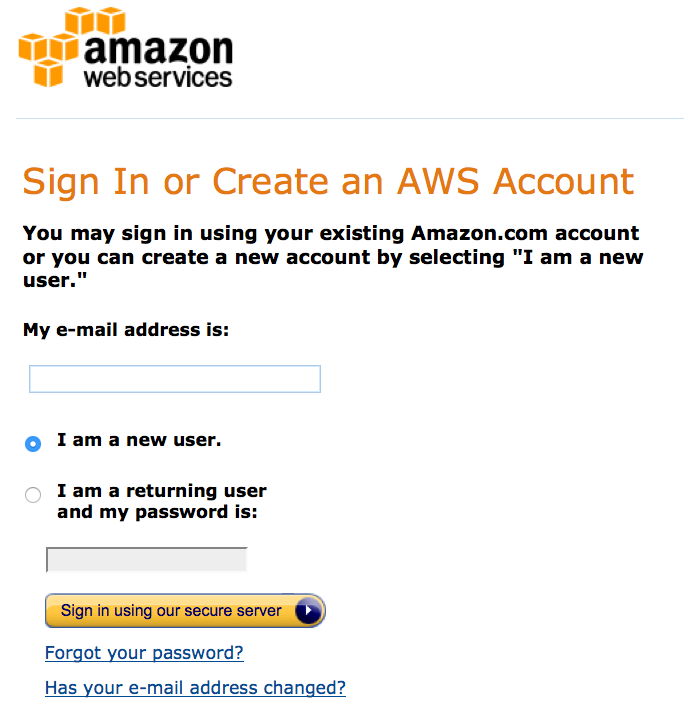

#Introduction to AWS Cloud Computing

###Preamble
Cloud computing allows users to quickly access an arbitrary amount of compute resources from a distance without the need to buy or maintain hardware themselves. There are many cloud computing services. This tutorial describes the use of Amazon's Web Services ([AWS](http://aws.amazon.com/)) elastic compute (EC2) resource. 

###What do I need to perform this tutorial?
To complete this tutorial, you will need a computer with access to the internet, a Web Browser, and a command line terminal application. We are going to access the Amazon EC2 console in your web browser and use it to configure and rent a remote computer from Amazon. We are then going to log into that computer from the command line. The computer you are working on can be almost anything and could be running Windows, Mac OSX, or Linux. The computer that we configure and rent from Amazon will be a Linux machine (though there are many other possibilities). You will use the terminal application on your computer to remotely log into this computer. The Amazon AWS computer you rent will be physically located somewhere that is likely far away from you. Depending on the 'Region' you select in Amazon AWS it could be physically located in one of several large compute warehouses in the North America, South America, Europe or Asia.   

There are two types of knowledge you will be exposed to in this tutorial.  First, use of the Amazon EC2 web console.  Since we are going to create 
 
###Creating an account
In order to use AWS the first time, you will have to create an account. In order to create and run instances as described in this tutorial, you will need to associate a credit card with that account for billing purposes. Refer to the sections below on how billing works, how to estimate costs, and how to ensure that you have properly shut down everything that you could be billed for.

###Logging into the AWS console
To log into AWS, go to the [aws.amazon.com](http://aws.amazon.com/) and hit the [Sign In to the Console](https://console.aws.amazon.com/console/home) button as shown below.  Once you are logged in, select `EC2` from the list of Amazon Web Services. This tutorial is entirely focused on `EC2` (with some mention of `S3`) so the `EC2` console will be the starting point for many of the activities described below.   

AWS home:

AWS log in:

###What is a Region?

###How much does it cost?
EC2 

###How does billing work?

###What are Security Groups and how do they work?

###What is a Key Pair and how does it work?

###Storage volumes. What is ephemeral storage? What is EBS backed storage? What is S3 storage?

###How do storage volumes appear within a Linux instance on Amazon EC2?

###What is difference between the 'Start', 'Stop', 'Reboot', and 'Terminate' (Instance States)?

###Acknowledgements
Creation of this tutorial on Amazon AWS EC2 was generously supported by [Amazon AWS Education grants](http://aws.amazon.com/grants/).