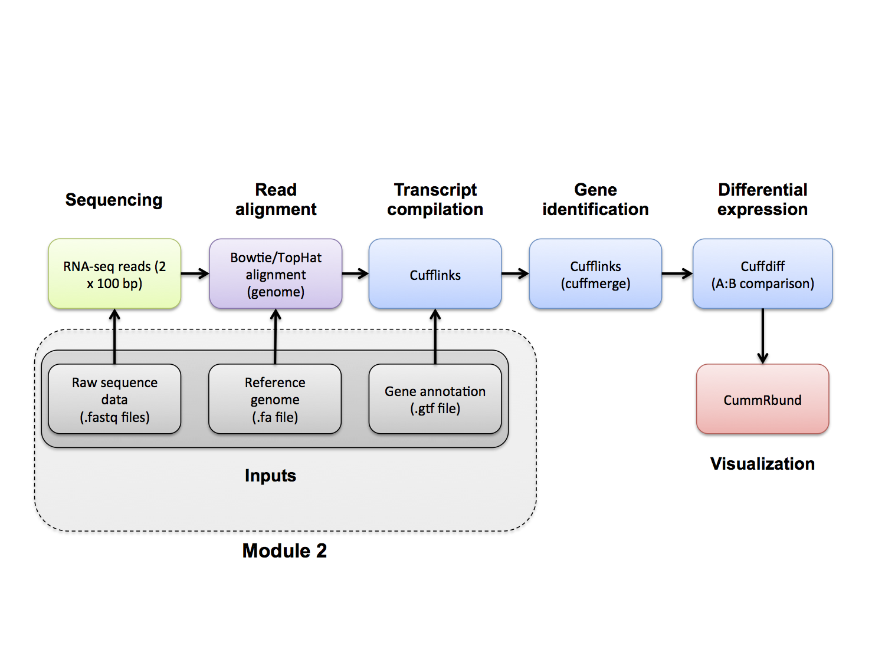

#2-ii. Reference Genome
Obtain a reference genome from iGenomes. In this example analysis we will use the human hg19/NCBI build 37 version of the genome. Furthermore, we are actually going to perform the analysis using only a single chromosome (chr22) and the ERCC spike-in to make it run faster...

Create the necessary working directory

	cd $RNA_HOME
	mkdir refs
	mkdir refs/hg19	
	mkdir refs/hg19/fasta
	mkdir refs/hg19/fasta/chr22_ERCC92/
	cd refs/hg19/fasta/chr22_ERCC92/
	
Make a copy of chr22 + ERCC fasta in your working directory. The complete data from which these files were obtained can be found at: http://cufflinks.cbcb.umd.edu/igenomes.html. You could use wget to download the Homo_sapiens_Ensembl_GRCh37.tar.gz file (under Homo sapiens -> Ensembl -> GRCh37), then unzip/untar.

This has been done for you and that data placed on an ftp server. It contains chr22 and ERCC transcript fasta files in both a single combined file and individual files. Download them now.

     wget https://xfer.genome.wustl.edu/gxfer1/project/gms/testdata/bams/brain_vs_uhr_w_ercc/downsampled_5pc_chr22/chr22_ERCC92.tar.gz
     tar -zxvf chr22_ERCC92.tar.gz
     rm chr22_ERCC92.tar.gz
	
View the first 10 lines of this file

	head chr22_ERCC92.fa
	
How many lines and characters are in this file?

	wc chr22_ERCC92.fa
	
Note: Instead of the above, you might consider getting reference genomes and associated annotations from UCSC  
e.g., ftp://hgdownload.cse.ucsc.edu/goldenPath/hg19/chromosomes/  
Wherever you get them from, the names of your reference sequences (chromosomes) must those matched in your annotation gtf files.

| [[Previous Section|Installation]] |                             | [[Next Section|Annotation]] |
|:---------------------------------:|:---------------------------:|:---------------------------:|
| [[Installation|Installation]]     | [[Table of Contents|Home]]  | [[Annotation|Annotation]]   |