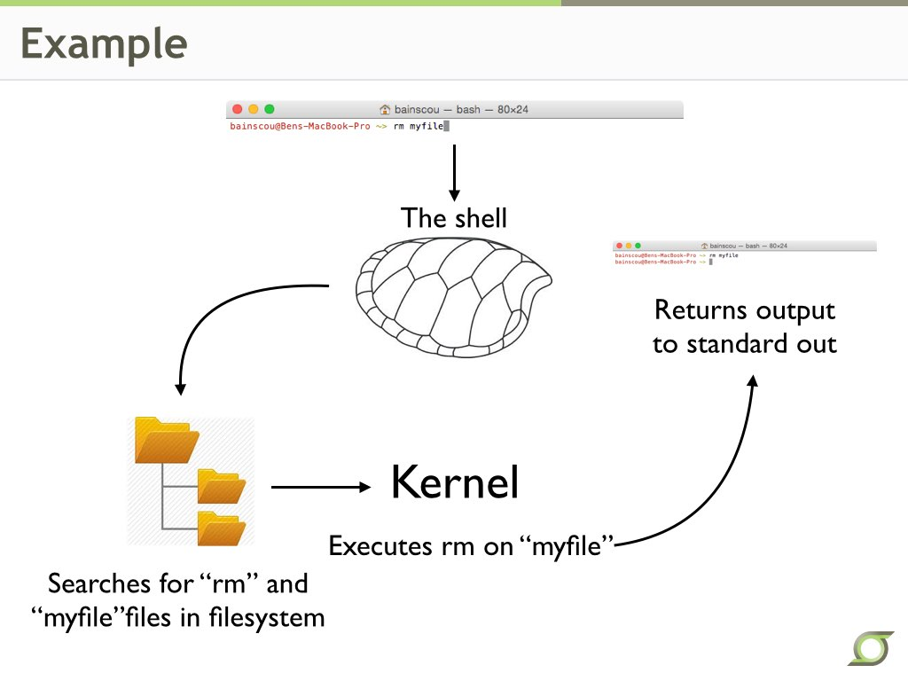

#Introduction(UNDER DEVELOPMENT)

UNIX is a command line operating system (OS)
* It is the backbone of popular graphical OS's like Apple's OS X and Linux

Unix is built on a simple modular philosophy
* UNIX is based on files and processes. In other words, all the OS 'sees' are files and processes even though there are directories and other types, they are all viewed by the OS as a file. This is useful as it makes it easier to pass files around the system.
* The OS provides a unified filesystem to facilitate communication between programs
* The OS operates on a set of simple programs that each provide a single well defined function.

##The Kernel

The kernel is the hub of the OS. It does all of the work behind the scenes.
* The kernel executes programs
* Allocates time and memory to programs

##The shell

The shell is the interface between the kernel and the user.
* Is a command line interpreter -- It has a defined syntax to execute processes
* Can be customized to user preferences
* Provides shortcuts for usability (tab completion)
* Stores a history of all commands run. Try `history` or press the up arrow in the terminal

#Commands
To get started open a terminal.
##Navigating the filesystem
Let's start by learning how to get around in unix. Before we get started there are a few things that you need to know. This first is your home directory. Your home directory is where you start when you open a new terminal. I is a folder that has the same name as your username. This is where you will store all your files on the system. There are a few other places that you need to know. One in / (yes, slash), this is the root directory for your system and is where you would go to find any system-wide files. 
###pwd
`pwd` stands for print working directory. Entering `pwd` should print your home directory to your screen because that is where you start out
###ls
`ls` stands for list. `ls` will list all of the files in your current directory. `ls` can also take arguments. To see the contents of your Documents folder type `ls Documents`.
###cd
`cd` stands for change directory. Entering `cd` with no arguments will always take you home if you get lost. `cd Documents` will change your current working directory into your Documents folder.
### . syntax
The `.` in UNIX is useful because it provides a relative location to where you are. `.` is a shortcut for your current directory. Compare the output of `ls` to `ls .`.
### .. syntax
`..` in UNIX is the location one directory above your current working directory.
### ~ syntax
`~` is a shortcut for you home directory and can be use in any path to reduce typing. For example `cd ~/Documents` will take you into you Documents folder from anywhere in the system.
### mkdir
`mkdir` stands for make directory. Entering this command will create a new directory. Let's make a playground folder in our home directory. To do this enter `cd` to take you home, then enter `mkdir playground` to create a playground folder. Change into your playground folder by `cd playground`.
### touch
### rm
### cp
### mv
### Wildcard character
## Opening and editing files
### cat
### head
### tail
### less
## UNIX Variables
## Permissions
## Finding things
## Input output
## Sorting